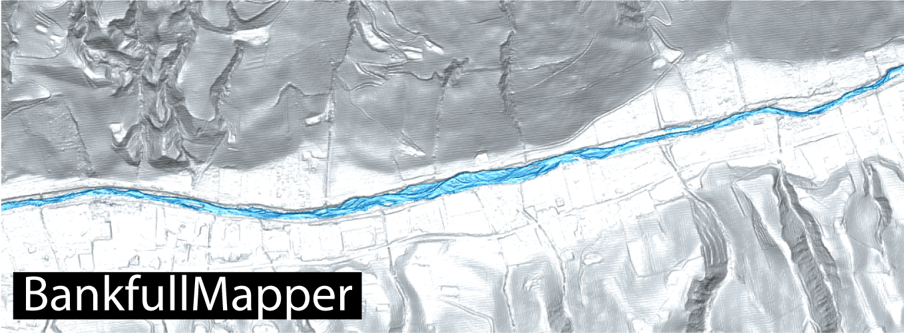

# BankfullMapper

BankfullMapper is a semi-automatic toolkit for bankfull geometry extraction and discharge estimation.

## Installation

You can either download the entire toolbox and add the folder `toolbox` and its subfolders to the search path. Alternatively, download the latest release of the toolbox (.mltbx). Once, you double-click the toolbox, it will be installed to MATLAB's add-on folder.

This toolkit includes Matlab functions to analyze the river bankfull geometry and derive discharge estimate applying Manning's equation. 

This toolkit requires TopoToolbox, which can be downloaded from https://github.com/wschwanghart/topotoolbox, and needs the same Matlab's built-in packages required for runnning TopoToolbox.

In addition to the built-in MATLAB packages required by TopoToolbox, this toolkit also requires the Signal Processing Toolbox.

## Getting Started

In the examples folder, you can find example_code.m and example_code2.m where two examples are reported.

The data for the examples can be downloaded at the following link: https://drive.google.com/drive/folders/1dM2VZWRmLslaq0dfifNAPaci4E1Bd0Pa?usp=drive_link

To run the tool with your data, just follow the general workflow in the WORKFLOW.m script. 

## References

Delchiaro, M., Ruscitto, V., Schwanghart, W., Brignone, E., Piacentini, D., and Troiani, F.. “BankfullMapper: a semi-automated MATLAB tool on high-resolution Digital Terrain Models for spatio-temporal monitoring of bankfull geometry and discharge”. Computers and Geosciences (under review).

Schwanghart, W., & Scherler, D., 2014. “TopoToolbox 2–MATLAB-based software for topographic analysis and modeling in Earth surface sciences”. Earth Surface Dynamics, 2(1), 1-7. https://doi.org/10.5194/esurf-2-1-2014